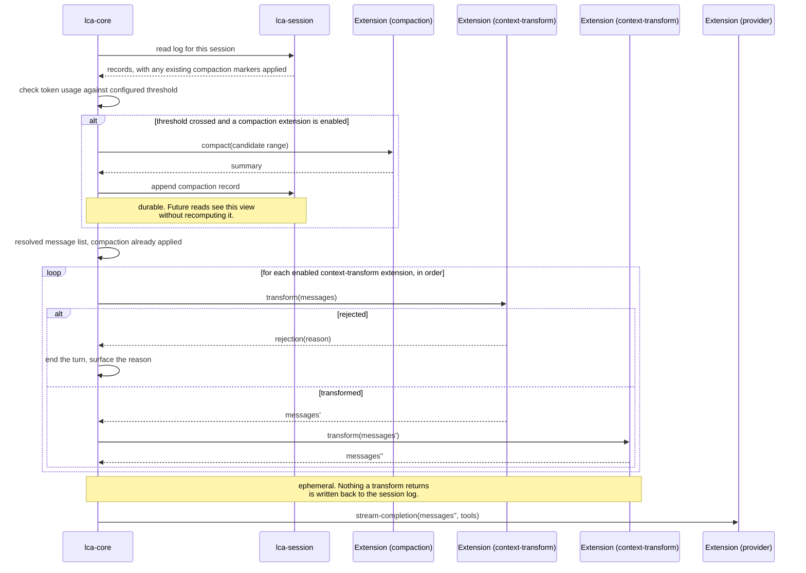
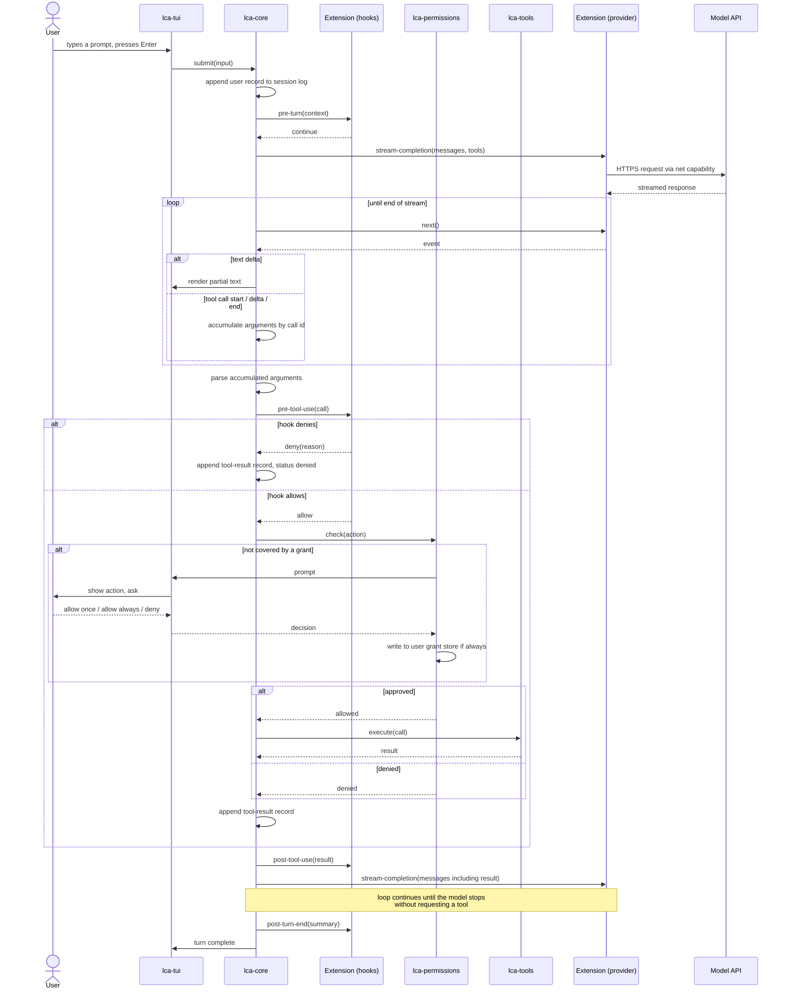
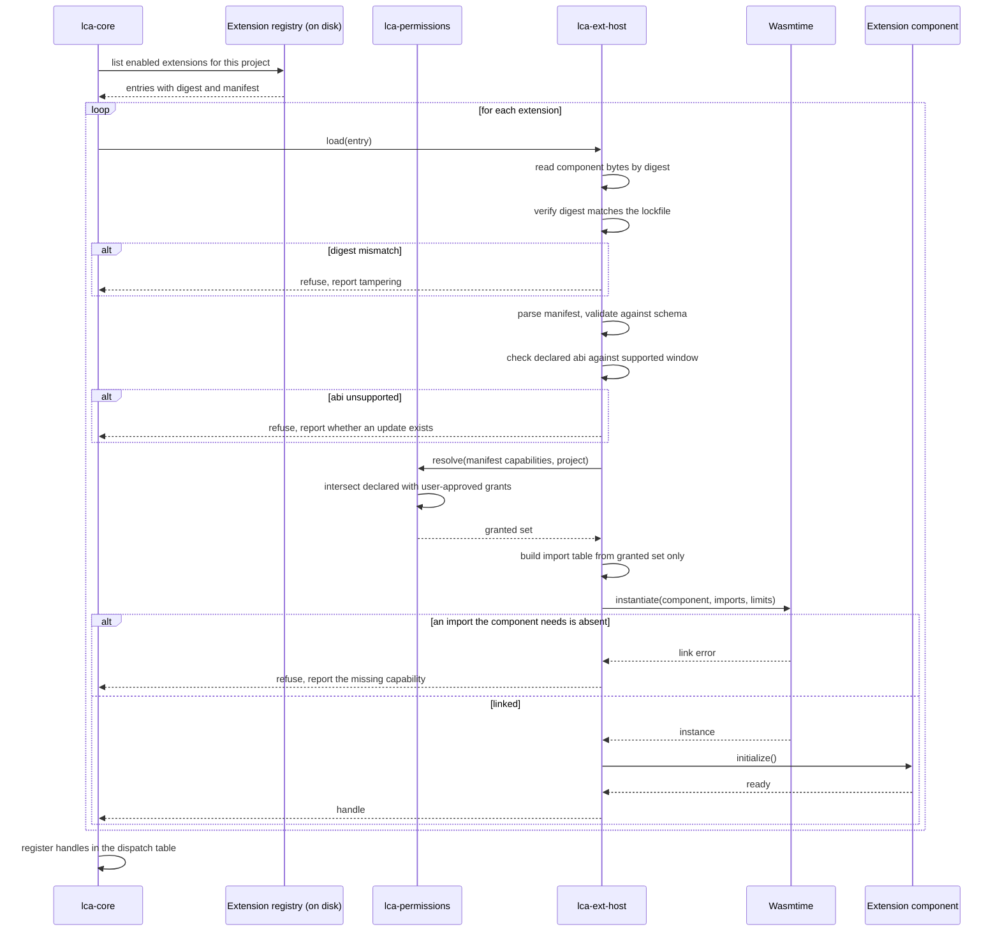
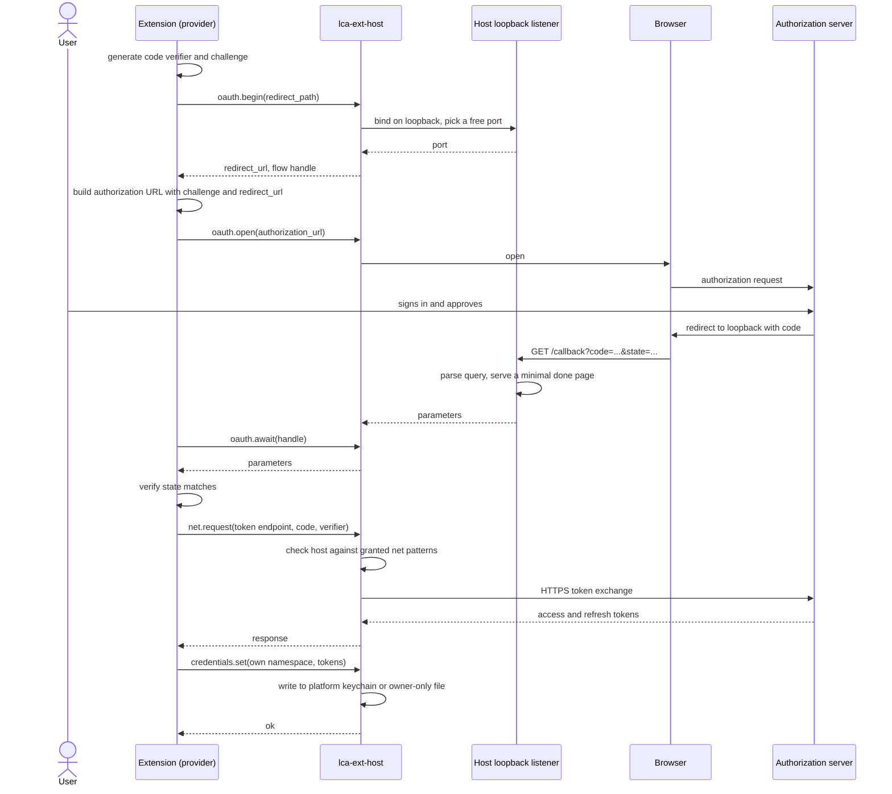
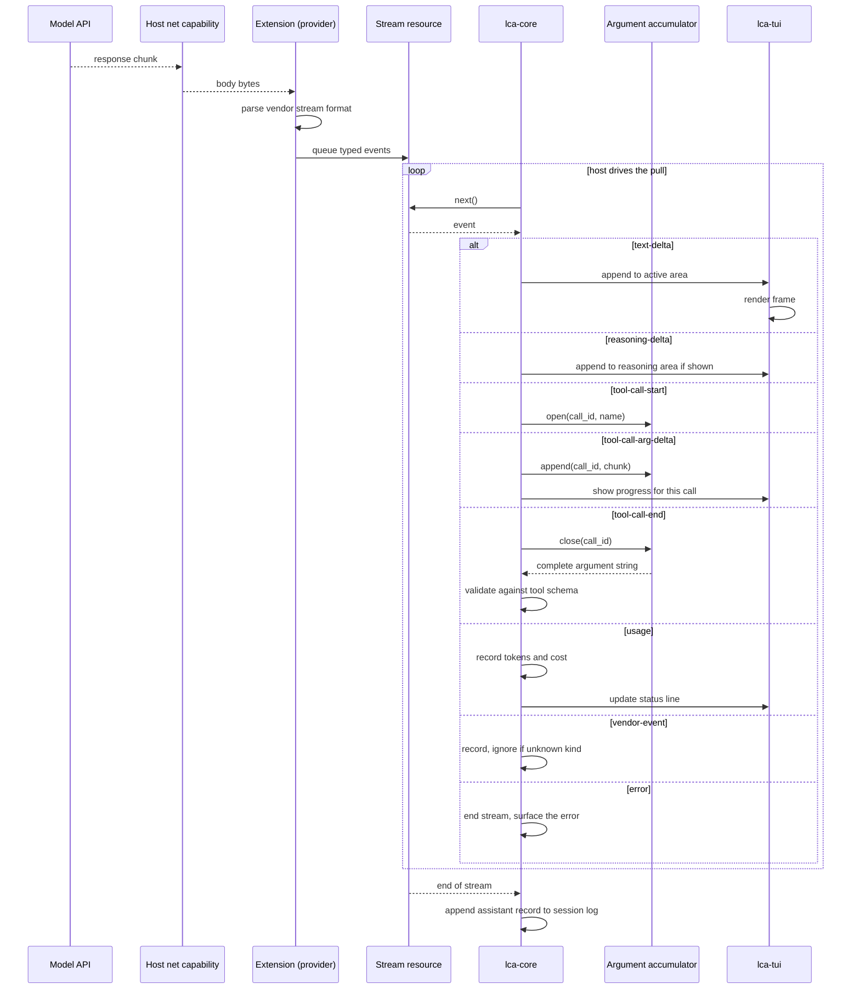
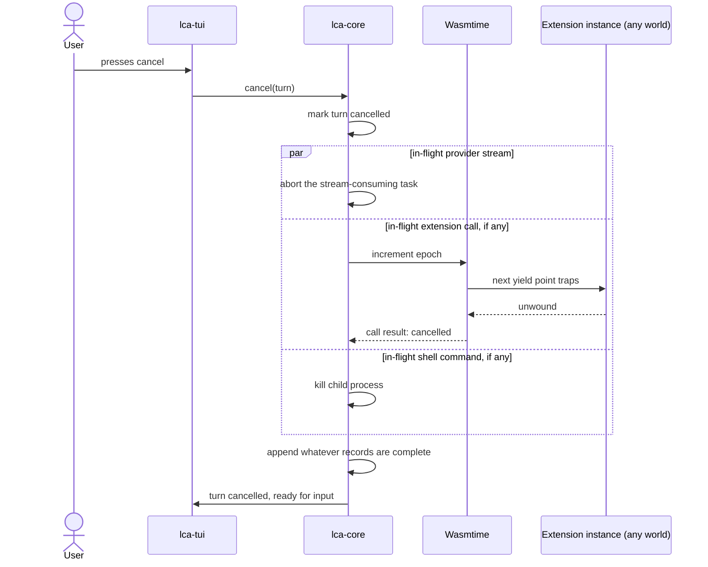

# Runtime flows

Version 0.1, 2026-09-20.

Six flows are hard to hold in your head from prose alone. Each one below has a diagram and the notes that the diagram cannot carry.

Diagrams use Mermaid. They render in most Markdown viewers and in the published document.

## From stored history to an outbound request

Before the main turn loop can call a provider, the host has to decide what messages actually go out. This is where compaction's cached view and the context-transform chain sit, both upstream of the "a turn with a tool call" flow below, which assumes this step has already happened.

Notes.

Compaction is threshold-triggered and rare by design; its result is written once and reused by every later read until usage crosses the threshold again. A context-transform extension runs on every single turn and touches nothing durable, which is why the two are separate worlds rather than one. See ADR-0015 for the full reasoning, including why a generic transform world, not a special hook power, is where something like skills injection or pre-send redaction belongs.

A rejection from any transform in the chain ends the turn before a provider is ever called, the same shape a hook denial already uses elsewhere in the design.

A compaction extension that summarizes well typically holds the `completion` capability to ask the host for a model response; a purely mechanical strategy, dropping the oldest turns or keeping only errored tool results, needs no such capability.

The message-count boundary between the compacted prefix and the dynamic suffix, computed at the top of this flow, travels with the request as the cache-boundary hint on the provider call. If a transform in the chain changes content inside that boundary relative to the previous turn's request, the host narrows what it reports for this turn rather than failing it, and records the divergence; see ADR-0017 and the cache behavior section of `docs/testing-plan.md`.

## A turn with a tool call

This is the main loop. Everything else in the agent exists to support it. It picks up after the context-assembly flow above has already produced the resolved message list.

Notes the diagram cannot carry.

Argument accumulation belongs to the core, not the provider. The provider emits fragments with a call identifier and the core joins them. A fragment arriving with no open start event is discarded and recorded as a protocol error.

The permission check runs after the hook, not before. A hook that denies a call stops it without ever prompting the user, which is what makes a policy extension useful. A hook cannot approve something the permission layer would deny.

Cancellation can arrive at any point. The core aborts the in-flight provider call, writes whatever records are complete, and returns to the prompt. A tool already running is stopped through its own cancellation path, and a shell child process is killed.

The loop between tool result and the next completion is where a turn spends most of its wall clock time in practice, and it is bounded by a configured maximum iteration count to stop a model from looping on a failing tool (FR-CORE-9).

## Extension instantiation and capability resolution

This runs at startup for every enabled extension, before the first user input.

Notes.

The import table is built from the granted set, not from the declared set. An extension whose manifest declares more than the user approved gets the intersection. If it needs an import that is missing, it fails at link time, on the first load, rather than at an unlucky moment later.

Native-linked extensions skip everything from the digest check through instantiation. They register directly and carry an unsandboxed label. This is the only path where the capability resolution does not run, and it is reserved for code that ships in the binary.

Resource limits are applied to the store at instantiation: a memory ceiling and a fuel budget per call. Both come from the manifest clamped to host maximums.

A trap during `initialize` disables the extension for the session and does not stop the agent from starting.

## The OAuth loopback flow

This is the flow that would need raw socket access if the host did not provide it. The extension never binds a port.

Notes.

The host picks the port, not the extension. An extension cannot request a specific port, which removes a class of conflict and a class of abuse.

The listener binds on the loopback interface only and stops when the flow completes or times out, by default after 300 seconds. A timeout returns an error the extension handles.

The token exchange goes through the `net` capability and is checked against the granted host patterns like any other request. An extension that declares `oauth` without `net` fails manifest validation, because this step would always be refused.

State verification is the extension's job. The host returns the parsed parameters without interpreting them.

Tokens land in the credential store under the extension's own namespace. No other extension can read them, and they never enter the session log.

## The streaming pipeline

From a byte arriving on a socket to a character on screen.

Notes.

The host pulls. The extension does not push. This keeps back pressure on the side that knows whether the interface can keep up, and it maps onto a native async stream later without changing the event variant.

Rendering is not one frame per event. The renderer coalesces on a frame interval, so a fast stream does not cost one redraw per token.

An unknown `vendor-event` kind is recorded and ignored. This is the case that exists so a new vendor concept does not force an ABI break.

An `error` event ends the stream. The core decides whether the error is retryable and either retries with backoff or surfaces it, keeping the session open either way.

A stream that ends with a tool call still open is a protocol error. The accumulator reports it, the call is discarded, and the turn ends rather than calling a tool with partial arguments.

## Cancellation reaching a running extension call

The user can cancel at any point, including mid-call inside a WASM extension. This is what epoch interruption is for, distinct from the fuel budget used for resource limiting; see ADR-0014 for why the two are kept separate.

Notes.

Epoch interruption does not wait for the extension's fuel budget to run out and does not depend on how generous that budget was. It traps at the instance's next yield point regardless, which is what makes cancellation latency a property of how often Wasmtime checks the epoch, not of an unrelated resource setting.

An extension whose call gets cancelled mid-write through the `fs` capability can be left with a partial write. The design does not guarantee atomicity across a cancellation; an extension author should treat this as a real possibility for anything it writes, not an edge case.

The three branches run concurrently, not in sequence: a cancelled turn does not wait for the provider stream to notice cancellation before also killing a shell command that was running alongside it.

